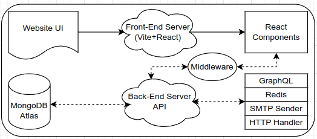

## e-commerce

Web app for buying goods used for intro to backend dev in Go.

## Stack

1. Vite + React
2. GraphQL Server

## Application workflow



## Installation

```zsh
chmod u+rx install.sh; ./install.sh
```

## Run
```zsh
cd client; npm run dev

go run server.go
```

## Architecture

```console
george@hotz:e-commerce$ tree -L 1 --dirsfirst
├── client
|   # all client code
├── configs
|   # main configs (for backend)
├── constants
|   # constants (for backend)
├── graph
|   # graphql API
├── handlers
|   # http handlers
├── middleware
├── models
|   # mongodb models
├── services
|   # mongodb services
├── tests
├── utils
|   # helpers
├── Dockerfile
├── go.mod
├── go.sum
├── gqlgen.yml
|   # yml file to generate gql schema
├── README.md
├── server.go
|   # server init
└── tasks.md
    # dev notes/tasks
```

